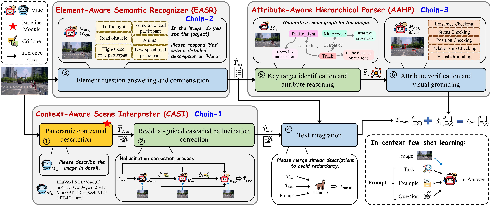
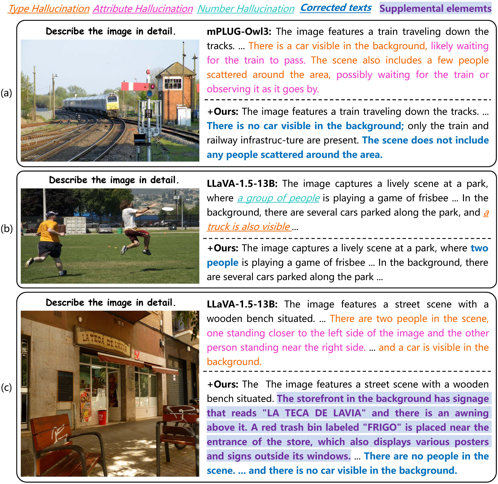
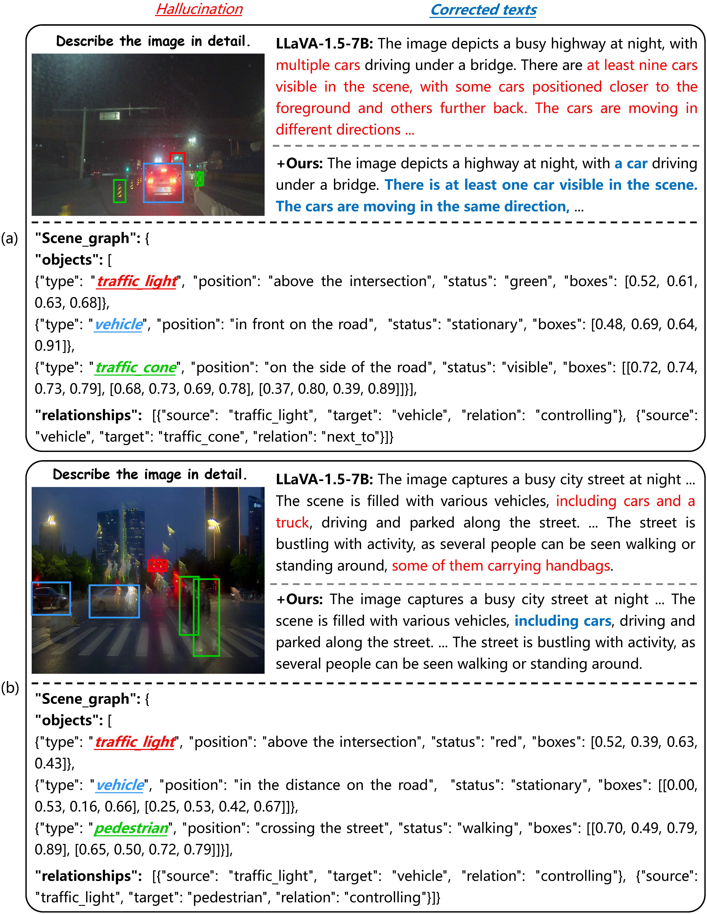

<div style="text-align: center;">
  <h1>HRCF-CoT: Hierarchical Reasoning and Cascaded Feedback Framework for Mitigating Hallucination and Enriching Understanding in Traffic Scenarios</h1>
</div>


> With the rapid development of Vision-Language Models (VLMs), large-scale, high-quality annotated data have become increasingly critical for effective model training. While leveraging VLMs for automatic annotation provides a scalable alternative to labor-intensive manual labeling, this approach is still hindered by two major issues: hallucination and omission. 
To tackle these challenges, we propose a novel HRCF-CoT framework that integrates hierarchical reasoning with cascaded feedback, guiding the model toward producing accurate and semantically rich descriptions. 
Specifically, we first introduce a residual-guided hallucination elimination method that corrects texts and yields context-aware descriptions. 
Then, we design an element-aware question-answering module to extract diverse elements, significantly improving the completeness of scene understanding.
After removing redundant contents, we leverage VLMs to construct graph-based scene representations, further deriving attribute-aware information for key objects.
Extensive experiments on seven hallucination benchmarks demonstrate the effectiveness of our framework: hallucination rates of GPT-4o and DeepSeek-VL2 are reduced by 1.58% on POPE and 5.60% on Object HalBench, respectively. Furthermore, LLaVA-1.6 model achieves a 48.26% increase in detailness and a 53.25% improvement in richness score.

If you have any question, please feel free to email fanjq@tongji.edu.cn.

## :fire: News
- Video demo [https://github.com/fjq-tongji/HRCF-CoT/releases/tag/video]
- Created datasets [https://github.com/fjq-tongji/HRCF-CoT/tree/main/Annotation_results]

## :book: Model


## :pill: Installation
1. LLaVA: https://github.com/haotian-liu/LLaVA
2. mPLUG-Owl: https://github.com/X-PLUG/mPLUG-Owl
3. MiniGPT-4: https://github.com/Vision-CAIR/MiniGPT-4
4. InternVL: https://github.com/OpenGVLab/InternVL
5. BLIP-2: https://huggingface.co/Salesforce/blip2-flan-t5-xxl
6. InstructBLIP: https://huggingface.co/Salesforce/instructblip-flan-t5-xxl
7. RAM: https://github.com/xinyu1205/recognize-anything
8. GroundingDINO: https://github.com/IDEA-Research/GroundingDINO


## :star: Inference
Generate annotations using HRCF-CoT framework: 
```
$ python 1.quen2_vl_initial_texts_CODA_1.py
$ python 2.inference_text_critic_minicpm_o_2_6.py
$ python 2.inference_text_critic_internvl_25.py
$ python 2.inference_text_critic_ovis2.py
$ python 3.inference_traffic_element_VQAs.py
$ python 4.inference_text_integrate.py
$ python 5.inference_scene_graph_generation.py
$ python 6.inference_scene_graph_validation.py
```
The specific reasoning code is in:
```
$ python vis_corrector_recap_w.py
```
The detailed code for each module is shown in folder models. 


## :trophy: Experimental Results
### Quantitative results 


### Qualitative results  
 
 


## :sunflower: Acknowledgement
This repository benefits from the following codes. Thanks for their awesome works.
- [LLaVA](https://github.com/haotian-liu/LLaVA)
- [mPLUG-Owl](https://github.com/X-PLUG/mPLUG-Owl)
- [MiniGPT-4](https://github.com/Vision-CAIR/MiniGPT-4)
- [InternVL](https://github.com/OpenGVLab/InternVL)
- [BLIP-2](https://huggingface.co/Salesforce/blip2-flan-t5-xxl)
- [InstructBLIP](https://huggingface.co/Salesforce/instructblip-flan-t5-xxl)(https://huggingface.co/Salesforce/instructblip-vicuna-13b)
- [Woodpecker](https://github.com/BradyFU/Woodpecker)
- [POPE](https://github.com/AoiDragon/POPE)
- [RAM](https://github.com/xinyu1205/recognize-anything)
- [GroundingDINO](https://github.com/IDEA-Research/GroundingDINO)

## :scroll: Citation

